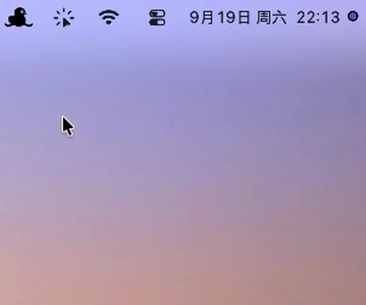

<h1 align="center">CueTap</h1>

<p align="center">
  Typing you prepared in advance, replayed one keystroke at a time.
</p>

<p align="center">
  <a href="LICENSE"></a>
  
  
  
  <a href="https://github.com/CheyYuAn/CueTap/stargazers"></a>
  <a href="https://github.com/CheyYuAn/CueTap/network/members"></a>
</p>

<p align="center">
  <a href="#install">Install</a> &bull;
  <a href="#permissions">Permissions</a> &bull;
  <a href="#usage">Usage</a> &bull;
  <a href="#configurations">Configurations</a> &bull;
  <a href="#commands">Commands</a> &bull;
  <a href="#with-an-ai-agent">AI agent</a>
</p>

<p align="center">
  
</p>

CueTap replays typing you prepared in advance, for live demos, talks, screencasts and teaching. Code, prose, commands, form fields, anything you can type.

You type at whatever rhythm your explanation takes and CueTap emits the prepared characters instead of yours. The typing looks real because it is real, but typos cannot happen.

It is one macOS command line tool with a menu bar icon. No window, no Dock icon, no recording, no network access.

## Install

```sh
brew install CheyYuAn/cuetap/cuetap
```

Or grab the archive from [Releases](https://github.com/CheyYuAn/CueTap/releases), then:

```sh
xattr -d com.apple.quarantine cuetap
sudo mv cuetap html-demo.json /usr/local/bin/
```

The `xattr` line clears the quarantine flag macOS puts on browser downloads. Homebrew downloads never carry it.

From source, with Xcode 27 or later:

```sh
git clone https://github.com/CheyYuAn/CueTap.git
cd CueTap && Skills/cuetap/scripts/build-local.sh "$PWD"
```

## Permissions

CueTap intercepts and emits keyboard events, so macOS requires two grants in System Settings under Privacy & Security. Give them to whatever launches CueTap, Terminal included.

- Accessibility
- Input Monitoring

While a demo runs, CueTap forces the ABC/U.S. input source so an IME cannot rewrite what gets typed, and restores your own when it stops.

After an upgrade CueTap may start but ignore the hotkey. Ad-hoc signatures change with every build and macOS treats the new one as a different program, so grant both permissions again. `cuetap doctor` confirms it.

## Usage

```sh
cuetap start
```

The icon appears in the menu bar and the bundled example loads. Open `tests/test.html` in an editor, put the cursor where the text belongs, press Command-Shift-R, and type anything.

One configuration can hold several segments, for text that belongs in different places. At the end of a segment CueTap keeps swallowing keystrokes while you navigate with the mouse, across files and applications. Command-click where the next segment starts and typing resumes there. After the last segment the keyboard stays locked for three seconds, absorbing keys pressed a beat too late, then the demo stops itself.

`cuetap stop` ends a demo, `cuetap quit` shuts the process down.

## Configurations

A configuration lists the actions to emit, as literal text or a named key with an optional repeat count.

```json
{
  "version": 2,
  "name": "My Demo",
  "segments": [
    {
      "name": "Segment 1",
      "actions": [
        { "type": "text", "value": "<div></div>" },
        { "type": "key", "key": "left", "count": 7 },
        { "type": "text", "value": " class=\"body\"" }
      ]
    }
  ]
}
```

Drop a file into `~/Library/Application Support/CueTap/configurations/` and it appears in the menu, or import one from anywhere with `cuetap load FILE`. Imported files are copied, never modified.

CueTap emits exactly what the configuration says. It does not read your document, predict the cursor or fix indentation, so your editor's auto-indent and bracket completion still apply. Test a new configuration in the editor you will present with.

Full format: [configuration.md](Skills/cuetap/references/configuration.md).

## Commands

`cuetap --help` lists everything, and every command takes `--json`.

Process control is `start`, `stop`, `quit`, `status`. Configurations are `config list|use|rename|export|remove`, plus `load` and `reload`. Shortcuts are `hotkey` and `advance`. Diagnostics are `doctor` and `validate`. Configurations and shortcuts change only while no demo is running.

## With an AI agent

[`Skills/cuetap/`](Skills/cuetap) is an Agent Skill. Hand a coding agent whatever you plan to type and it writes, imports and selects the configuration for you. Starting the demo stays with you, at the keyboard, in front of the audience.

## Privacy

No network connections, and keystrokes are never logged. `~/Library/Logs/CueTap/runtime.log` records process events only.

## License

MIT
